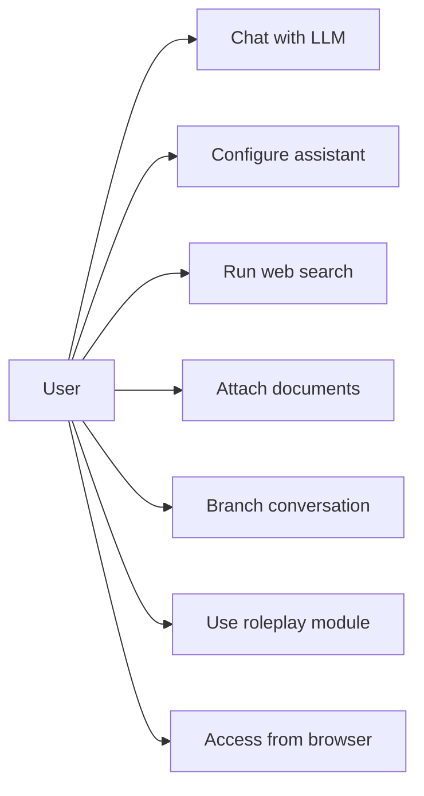
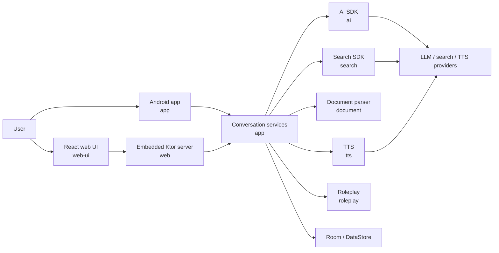
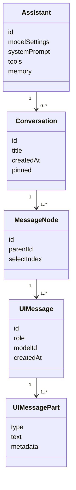
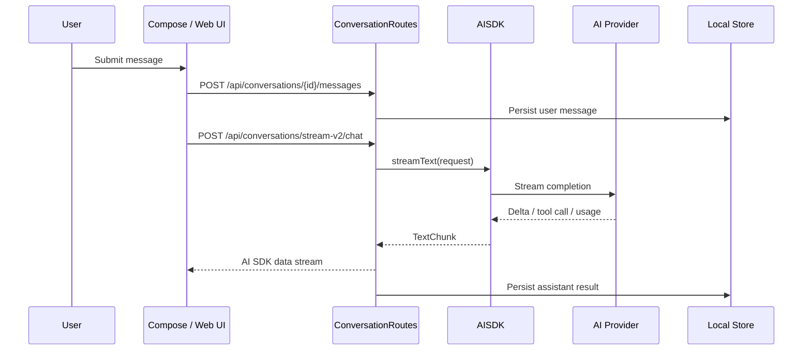
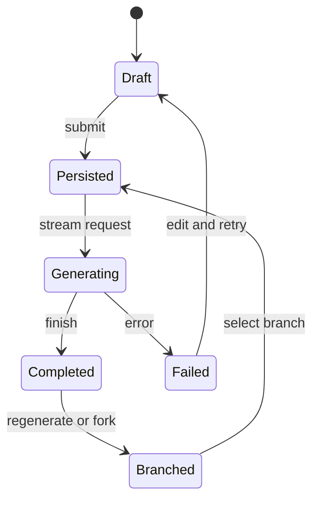
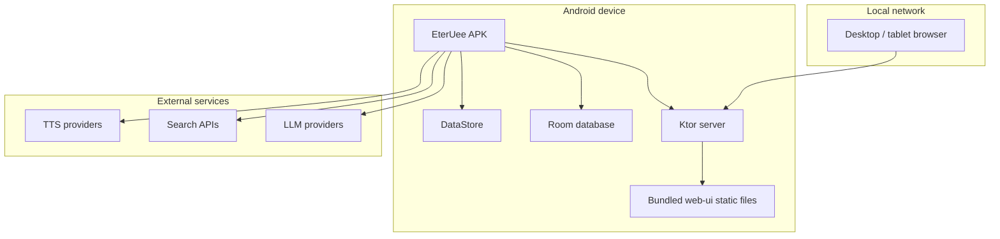
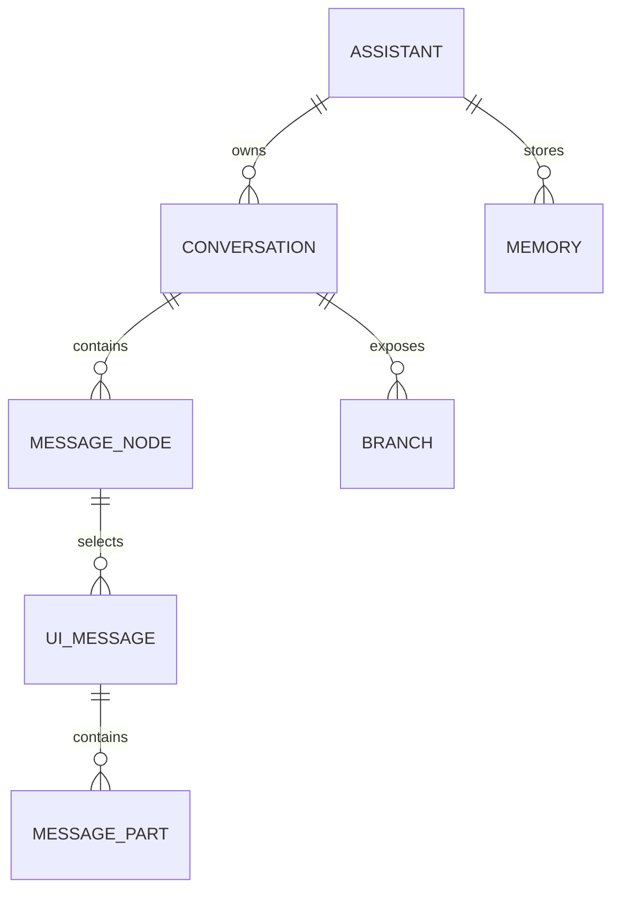

# EterUee


Native Android LLM chat client.

Languages: English | [简体中文](README_ZH_CN.md) | [繁體中文](README_ZH_TW.md)

## Scope

- Android client built with Kotlin and Jetpack Compose.
- Multi-provider AI access through a shared `ai` module.
- Tree-based conversations with message branches.
- Assistants with isolated model, prompt, memory, tool, and request settings.
- Document, search, TTS, syntax highlighting, and roleplay modules.
- Embedded Ktor server that hosts the React web UI on the local network.

## Modules

| Path | Responsibility |
| --- | --- |
| `app` | Android app, Compose UI, ViewModels, persistence, web routes |
| `ai` | Provider abstraction, message model, streaming text generation |
| `common` | Shared utilities and Kotlin extensions |
| `document` | PDF, DOCX, PPTX parsing |
| `highlight` | Code syntax highlighting |
| `roleplay` | Character, chat, world info, preset, group workflows |
| `search` | Search providers and search SDK integration |
| `tts` | Text-to-speech providers |
| `web` | Embedded Ktor server and static web UI hosting |
| `web-ui` | React frontend for browser access |

## Build

`app/google-services.json` is required for Firebase-backed builds.

```bash
git clone https://github.com/EterUltimate/EterUee.git
cd EterUee
./gradlew assembleDebug
```

## Test

```bash
./gradlew test
./gradlew connectedDebugAndroidTest
```

## APK

```bash
./gradlew :app:assembleDebug
```

Debug APKs are written to:

```text
app/build/outputs/apk/debug/
```

## UML

### Use Cases



### Component



### Conversation Model



### Chat Stream



### Message State



### Deployment



### Data Relations



## Development

- Use Android Studio for Android modules.
- Use Gradle wrapper commands from the repository root.
- Use `web-ui/` for React frontend work.
- Do not commit generated build output.

## Acknowledgements

Thanks to [Rikkahub](https://github.com/rikkahub/rikkahub). Its work in the Android LLM client space is an important reference and source of inspiration for this project.

## License

Dual license:

- [AGPL v3](LICENSE) for open-source and non-commercial use.
- Commercial license for commercial use.
