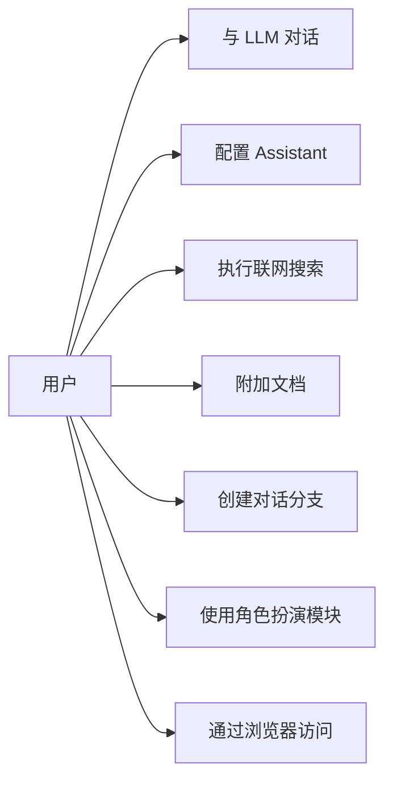
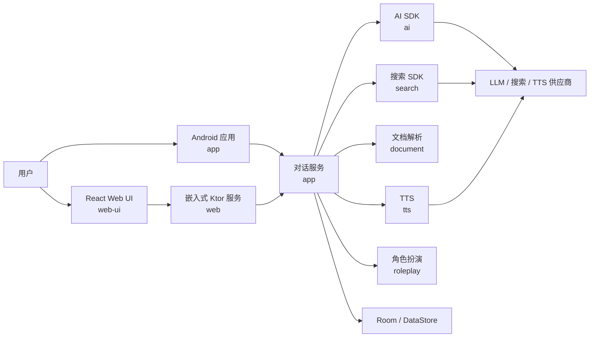
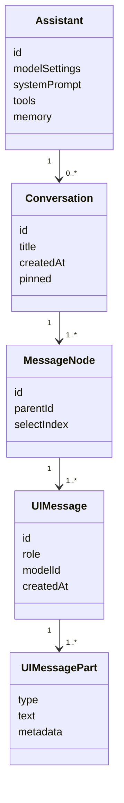
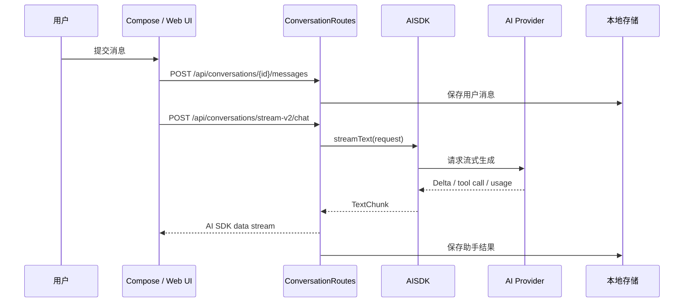
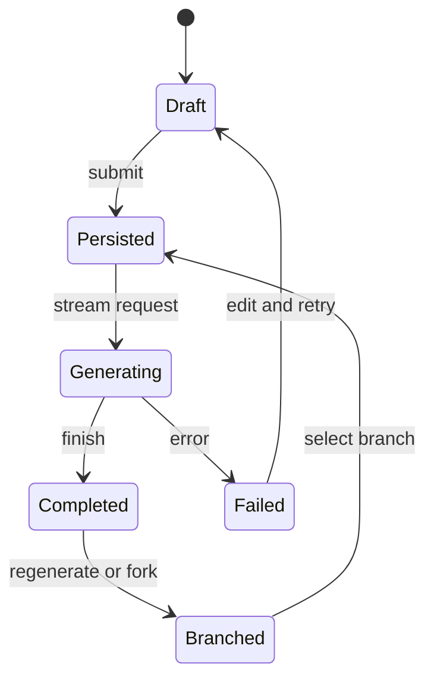
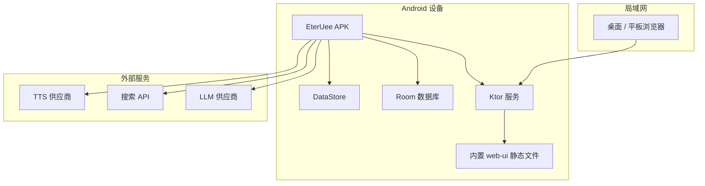
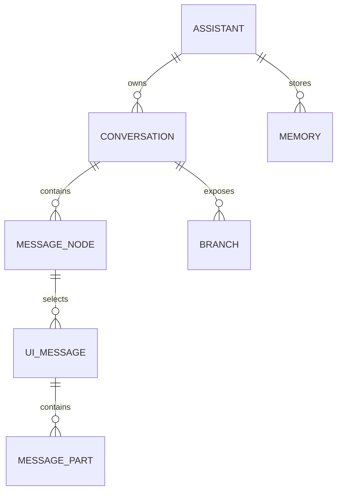

# EterUee


原生 Android LLM 聊天客户端。

语言：[English](README.md) | 简体中文 | [繁體中文](README_ZH_TW.md)

## 范围

- 使用 Kotlin 与 Jetpack Compose 构建的 Android 客户端。
- 通过 `ai` 模块统一接入多类 AI 供应商。
- 树状对话结构，支持消息分支。
- Assistant 独立保存模型、提示词、记忆、工具、请求配置。
- 文档解析、联网搜索、TTS、代码高亮、角色扮演模块。
- 内置 Ktor 服务，在局域网中提供 React Web UI。

## 模块

| 路径 | 职责 |
| --- | --- |
| `app` | Android 应用、Compose UI、ViewModel、持久化、Web 路由 |
| `ai` | Provider 抽象、消息模型、流式文本生成 |
| `common` | 共享工具与 Kotlin 扩展 |
| `document` | PDF、DOCX、PPTX 解析 |
| `highlight` | 代码语法高亮 |
| `roleplay` | 角色、聊天、世界书、预设、群组工作流 |
| `search` | 搜索供应商与搜索 SDK 集成 |
| `tts` | 文本转语音供应商 |
| `web` | 嵌入式 Ktor 服务与静态 Web UI 托管 |
| `web-ui` | 浏览器访问用 React 前端 |

## 构建

Firebase 构建需要 `app/google-services.json`。

```bash
git clone https://github.com/EterUltimate/EterUee.git
cd EterUee
./gradlew assembleDebug
```

## 测试

```bash
./gradlew test
./gradlew connectedDebugAndroidTest
```

## APK

```bash
./gradlew :app:assembleDebug
```

Debug APK 输出目录：

```text
app/build/outputs/apk/debug/
```

## UML

### 用例图



### 组件图



### 对话模型



### 聊天流



### 消息状态



### 部署图



### 数据关系



## 开发

- Android 模块使用 Android Studio。
- Gradle 命令从仓库根目录执行。
- React 前端位于 `web-ui/`。
- 不提交生成的构建产物。

## 致谢

感谢 [Rikkahub](https://github.com/rikkahub/rikkahub)。它在 Android LLM 客户端方向上的工作，是本项目重要的参考与灵感来源。

## 许可证

双许可证：

- [AGPL v3](LICENSE)：开源与非商业使用。
- 商业许可：商业用途请联系项目维护者。
