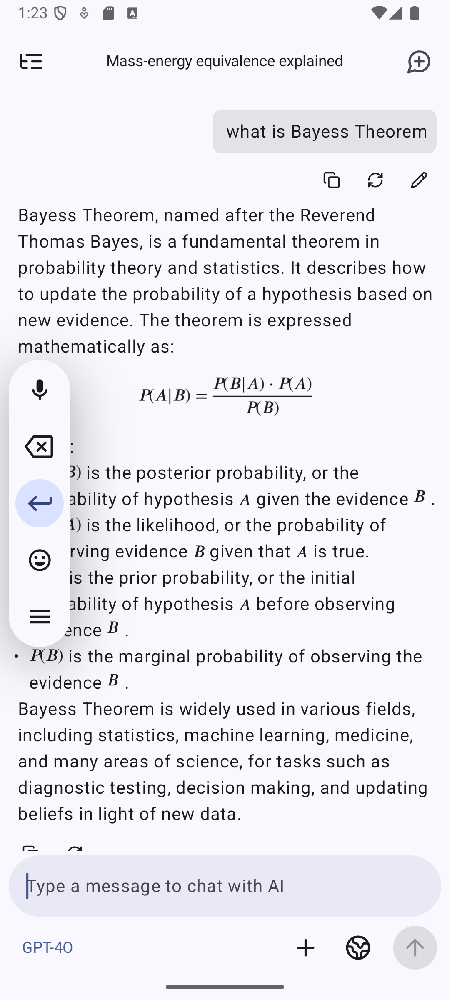

<div align="center">
  
  <h1>EterUee</h1>
  <p><strong>一款原生 Android LLM 聊天客户端，赛博朋克美学锻造 — 纯黑画布、RGB 纯色、零圆角、霓虹数据流。</strong></p>
  <p>
    <a href="README.md">English</a> |
    <a href="README_ZH_TW.md">繁體中文</a> |
    简体中文
  </p>
</div>

<div align="center">
  
  
</div>

## 🚀 下载

从源码构建或从 <a href="https://github.com/EterUltimate/EterUee/releases">GitHub Releases</a> 下载最新 APK。

## ✨ 功能特色

- 🎨 **赛博朋克设计** — 纯黑背景、RGB 纯色、零圆角
- 🔄 **通用 AI 供应商** — 自定义 API / 基础 URL / 模型（OpenAI、Google、Anthropic 及所有兼容端点）
- 🖼️ **多模态输入** — 图片、文本、PDF、DOCX、PPTX
- 🖥️ **Web 多端访问** — 内置 Ktor 服务器 + React web-ui，支持桌面/平板使用
- 🛠️ **MCP 支持** — SSE 和 STDIO 双模式工具调用
- 🐚 **SSH 与 Shell** — 内置终端，支持远程服务器交互
- 🔀 **消息分支** — 树状对话结构，支持重新生成与切换
- 🔍 **联网搜索** — Exa、Tavily、Zhipu、LinkUp、Brave、Perplexity 等
- 🧩 **Prompt 变量** — 模型名称、当前时间、日期、自定义占位符
- 🤳 **二维码同步** — 通过二维码导出/导入供应商配置
- 🤖 **智能体自定义** — 每个助手独立系统提示、温度、上下文窗口、请求头
- 🧠 **类 ChatGPT 记忆** — 按助手持久化的跨对话记忆
- 📝 **AI 翻译** — 一键翻译消息
- 🌐 **自定义 HTTP 请求头与请求体** — 完整请求定制
- 💌 **Silly Tavern 角色卡导入** — 支持 .png 角色卡
- 📡 **局域网发现** — 自动发现局域网内的供应商
- 🧪 **消息转换器** — 模板、正则、OCR、think 标签提取、文档转提示词
- 🌙 **纯深色模式** — 沉浸式 OLED 友好界面

## 🏗️ 架构

```
EterUee
├── app          — 主 Android 应用（Compose UI、ViewModel、导航）
├── ai           — AI SDK 抽象层（OpenAI、Google、Anthropic、流式）
├── common       — 共享工具类与 Kotlin 扩展
├── document     — 文档解析器（PDF、DOCX、PPTX）
├── highlight    — 代码语法高亮引擎
├── search       — 搜索 SDK（Exa、Tavily、Zhipu、LinkUp、Brave、Perplexity）
├── tts          — 文本转语音供应商
├── web          — 嵌入式 Ktor 服务器 + 静态 web-ui 托管
└── web-ui       — React + Vite 跨平台 Web 前端
```

## 🛠️ 技术栈

| 分类 | 技术 | 用途 |
|------|------|------|
| 语言 | <a href="https://kotlinlang.org/">Kotlin</a> | 主要开发语言 |
| UI | <a href="https://developer.android.com/jetpack/compose">Jetpack Compose</a> | 声明式 Android UI |
| UI | <a href="https://m3.material.io/">Material You</a> | 设计系统与动态主题 |
| 图标 | <a href="https://composeicons.com/icon-libraries/lucide">compose-icons/lucide</a> | 图标库 |
| 依赖注入 | <a href="https://insert-koin.io/">Koin</a> | 依赖注入 |
| 导航 | <a href="https://developer.android.com/develop/ui/compose/navigation">Navigation Compose</a> | 应用内导航 |
| 存储 | <a href="https://developer.android.com/topic/libraries/architecture/datastore">DataStore</a> | 偏好设置与协议存储 |
| 数据库 | <a href="https://developer.android.com/training/data-storage/room">Room</a> | 本地 SQLite 持久化 |
| 网络 | <a href="https://square.github.io/okhttp/">OkHttp</a> | HTTP 客户端 |
| 序列化 | <a href="https://github.com/Kotlin/kotlinx.serialization">kotlinx.serialization</a> | JSON 处理 |
| 图片 | <a href="https://coil-kt.github.io/coil/">Coil</a> | 图片加载与缓存 |
| Web 服务器 | <a href="https://ktor.io/">Ktor</a> | web-ui 嵌入式服务器 |
| Web 前端 | React + Vite | 跨平台 Web 前端 |

## 🏗️ 源码构建

```bash
# 1. 克隆仓库
git clone https://github.com/EterUltimate/EterUee.git
cd EterUee

# 2. 添加 google-services.json（Firebase 必需）
# 将你的 google-services.json 放入 app/ 目录下。

# 3. 构建 Debug APK
./gradlew assembleDebug
```

> [!TIP]
> 你需要在 `app/` 文件夹下添加 `google-services.json` 文件才能构建应用。

## 🤝 贡献指南

1. **Fork** 本仓库
2. 创建 **功能分支**（`git checkout -b feature/amazing-feature`）
3. **提交** 更改（`git commit -m 'Add amazing feature'`）
4. **推送** 到分支（`git push origin feature/amazing-feature`）
5. 发起 **Pull Request**

本项目使用 <a href="https://developer.android.com/studio">Android Studio</a> 开发，欢迎提交 PR！

## ⭐ Star History

如果喜欢这个项目，请给个 Star ⭐

<a href="https://star-history.com/#EterUltimate/EterUee&Date">
  
</a>

## 📄 许可证

本项目采用双许可模式：

- <a href="LICENSE">AGPL v3</a> — 非商业及开源使用
- **商业许可** — 商业用途请联系我们

详见 <a href="LICENSE">LICENSE</a> 文件。
