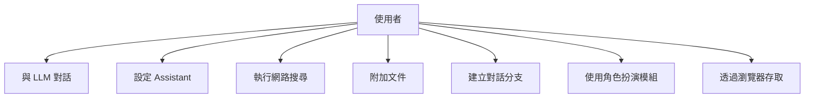
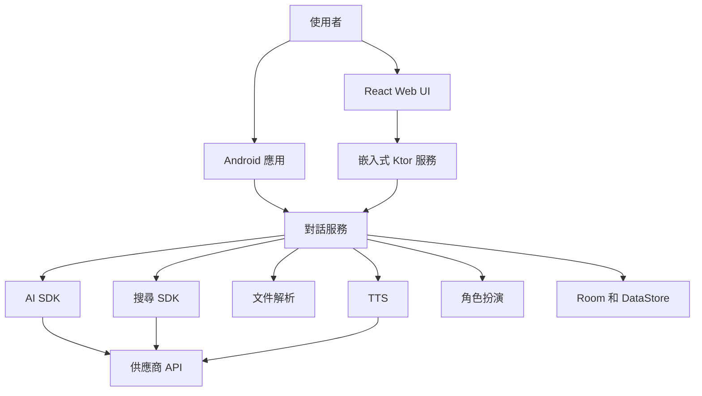
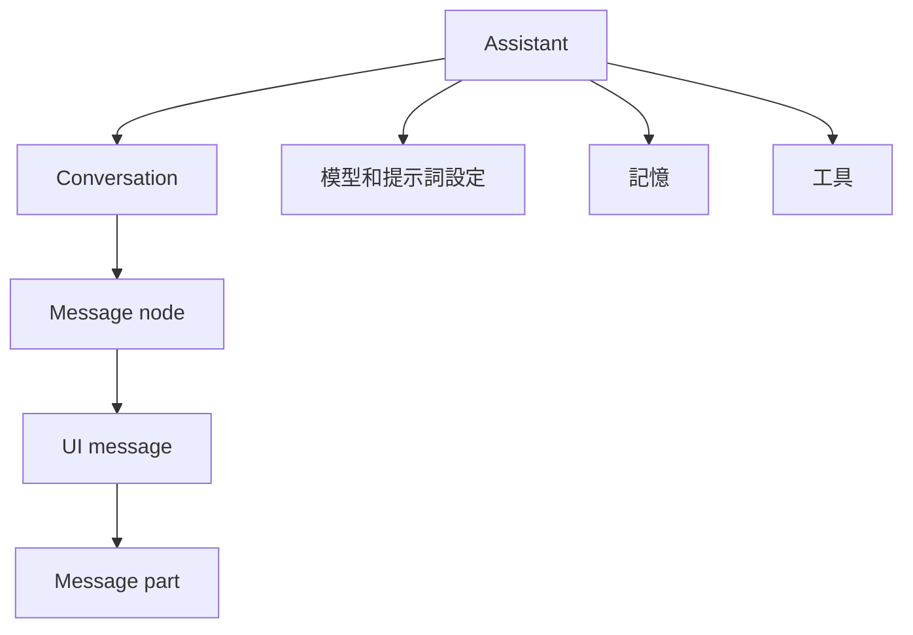
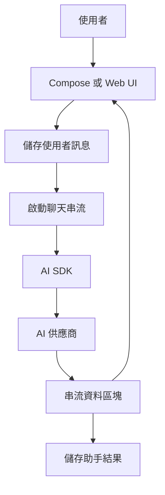
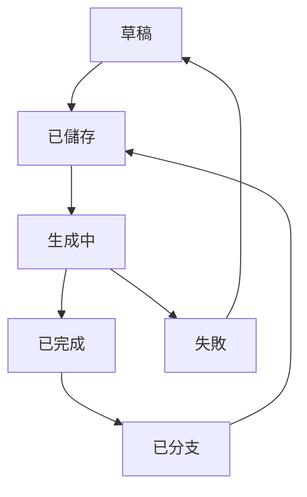
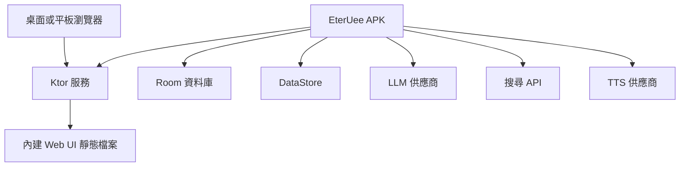
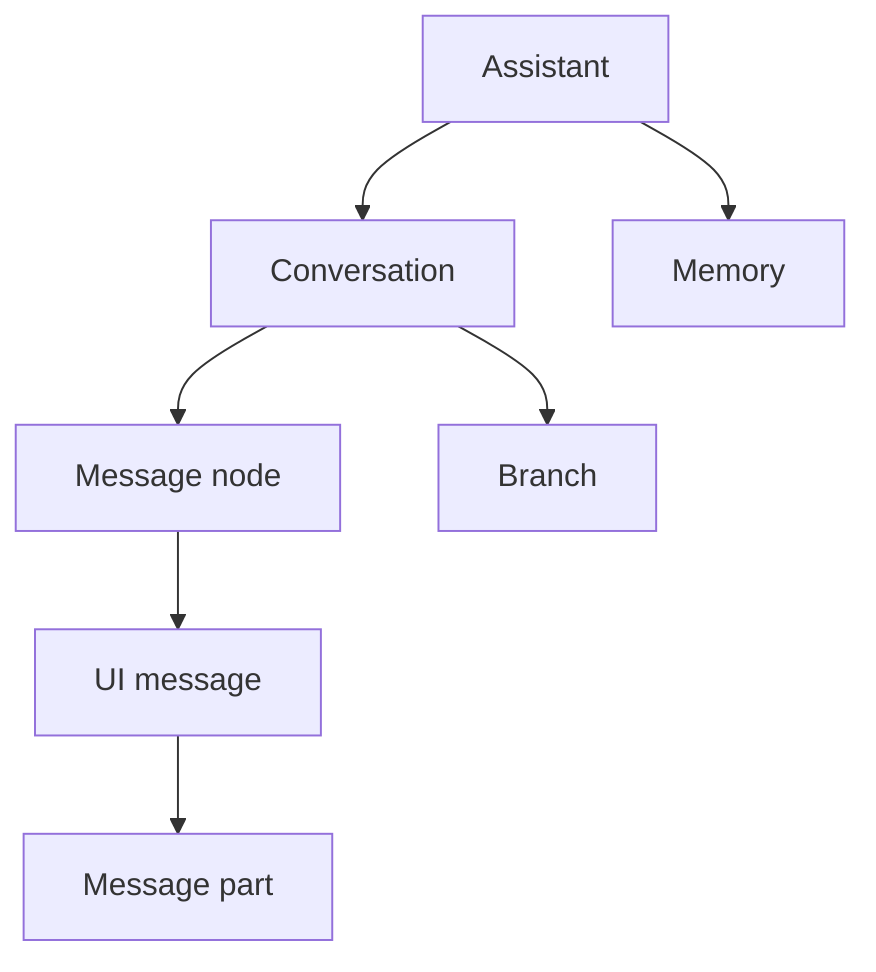

# EterUee


原生 Android 與桌面 LLM 聊天客戶端。

語言：[English](README.md) | [簡體中文](README_ZH_CN.md) | 繁體中文

## 範圍

- 使用 Kotlin 與 Jetpack Compose 建構的 Android 客戶端。
- 使用 Compose Multiplatform 打包 Windows 和 Linux 桌面 GUI。
- 透過 `ai` 模組統一接入多類 AI 供應商。
- 樹狀對話結構，支援訊息分支。
- Assistant 獨立儲存模型、提示詞、記憶、工具、請求設定。
- 文件解析、網路搜尋、TTS、程式碼高亮、角色扮演模組。
- 內建 Ktor 服務，在區域網路中提供 React Web UI。

## 模組

| 路徑 | 職責 |
| --- | --- |
| `app` | Android 應用、Compose UI、ViewModel、持久化、Web 路由 |
| `ai` | Provider 抽象、訊息模型、串流文字生成 |
| `common` | 共用工具與 Kotlin 擴充 |
| `desktop` | Compose Desktop GUI 外殼與原生桌面安裝包 |
| `document` | PDF、DOCX、PPTX 解析 |
| `highlight` | 程式碼語法高亮 |
| `roleplay` | 角色、聊天、世界書、預設、群組工作流程 |
| `search` | 搜尋供應商與搜尋 SDK 整合 |
| `tts` | 文字轉語音供應商 |
| `web` | 嵌入式 Ktor 服務與靜態 Web UI 託管 |
| `web-ui` | 瀏覽器存取用 React 前端 |

## 建置

Firebase 建置需要 `app/google-services.json`。

```bash
git clone https://github.com/EterUltimate/EterUee.git
cd EterUee
./gradlew assembleDebug
```

## 測試

```bash
./gradlew test
./gradlew connectedDebugAndroidTest
```

## APK

```bash
./gradlew :app:assembleDebug
```

Debug APK 輸出目錄：

```text
app/build/outputs/apk/debug/
```

## 桌面端

```bash
./gradlew :desktop:desktopReleaseAppImage
```

原生桌面安裝包必須在目標作業系統上建置：

```powershell
.\gradlew.bat :desktop:desktopReleasePackage
```

```bash
./gradlew :desktop:desktopReleasePackage
```

輸出目錄：

```text
desktop/build/compose/binaries/main-release/
```

app image 任務會校驗可執行的桌面 GUI 啟動器並寫入 `desktop-app-image-manifest.txt`。
原生安裝包任務會額外建置 Windows `.exe` 或 Linux `.deb`，並寫入
`desktop-release-manifest.txt`。

## UML

### 使用案例圖



### 元件圖



### 對話模型



### 聊天串流



### 訊息狀態



### 部署圖



### 資料關係



## 開發

- Android 模組使用 Android Studio。
- Gradle 指令從倉庫根目錄執行。
- React 前端位於 `web-ui/`。
- 不提交生成的建置產物。

## 致謝

感謝 [Rikkahub](https://github.com/rikkahub/rikkahub)。它在 Android LLM 客戶端方向上的工作，是本專案重要的參考與靈感來源。

## 授權

雙授權：

- [AGPL v3](LICENSE)：開源與非商業使用。
- 商業授權：商業用途請聯絡專案維護者。
